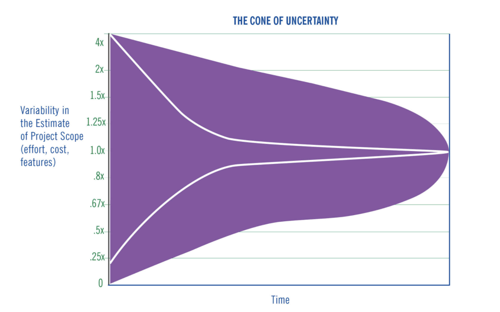

# Chapter 1

The way the world works is broken
The author talks about the history of how different methodologies are used to manage the project and create value for the stakeholders. Waterfall has been an old methodology used to manage projects and deliver value but it doesn't work as planning doesn't meet the reality. He introduces a new concept "Scrum" which addresses this problem by incorporating how people work rather than what people say.  It is based on rugby where the team huddles and addresses the strategy again. It embraces creativity and uncertainty. It requires thought, inspection, honesty, and discipline. Scrum improves the productivity of the team. The author builds the case for  Scrum by giving different scenarios of improving FBI, healthcar.gov, and many more. 

The author declares that the waterfall method doesn't work but doesn't provide a very sound reason for it. He provides the correct reasons for why Scrum would work. Scrum provides a way where people can use it to their advantage to derail the project and the ultimate focus would have been to deliver value and continuous measures of improving productivity.

# Chapter 2

## Origin of Scrum

The author talks about the origin of scrum how he got it from World War II warfare strategy. His background in flying and systems engineering helped him to build a framework that treated organizations and teams as complex systems.

## Learning to think Like a robot
A career in the military and academia helped the author to see the business through a different lens. He developed the technique: Observe, Orient, Decide and Act to solve problems which he learnt in the training of pilot while fighting in Vietnam.

## Don't go chasing Waterfalls
Plan is nicely laid out but doesnt meet the reality. Best teams include overlapping development processes that is faster and more flexible. The teams are cross-functional.

## Inspect and Adapt
Statistical Process Control revolves around measuring what is done, and how well, and to strive for "continuous improvement". Use PDCA ( Plan, Do, Check, Act) to measure and improve any productions systems.

## Change or Die
Business cycles are getting shorter and customers are demanding more responsive services.

## Shu Ha Ri
Shu means knowing all the rules, Ha means making innovations and Ri means reaching a stage where every step is creative in unhindered way.

# Chapter 3

## Teams
Focus on team performance. There is great difference between best and worst team. The alignment of trust and purpose leads to true greatness. Following are the elements of great team:-
- Transcendent
- Autonomous
- Cross-Functional
- Motivation from within

## The Long Grey Line
Duty, Honour, Country 

## Scrum in the time of revolt
Team decides how they are going to do the work. Management's responbility is to set the strategic gols. It is the team job is to reach them. There are generally three questions team answeres:-
- What did you do since last time we talked?
- What are you going to do before we talk again?
- What is getting your way?

## One team to get the Job done
In a classically organized team, we might have team of planners, followed by team of builders, followed by team of builders, followed by team of testers, followed by team of production and followed by team of shipping. Authors for in a team is a diversity - of skill set, thinking and experience. A team can get the whole job done. 

## Scrum at War
Cross-Functional Team that has all necessary skills to get the job done. 

## Size does Matter, but not the way you think
Once the team grows larger than eight, they took dramatically longer to get the job done. 7 is the ideal number. 

## Scrum Master
Not a manager, servant leader, something between a team captain and coach. How can we do what we do better?

## Dont hate the player, hate the game
Its the system that surrounds us, rather than any intrinsic quality, that accounts for vast majority of our behavior. What Scrum is designed to do si change that system. Instead of looking for blame and fault, it rewards positive behavior by focusing people on working together and getting things done.

## Reaching Greatness
When team aligns and synchronize, they seem magical. They look floating and greater than themselves. Its about setting up the right framework with right incentives and giving people the freedom, respect and authority to do things themselves.

# Chapter 4

## Time
It's about how much time to spend? We are lousy focusers, we spend way more time in the office than needed, we are a horrible estimator of how long things will take. This is all people.

## The Sprint
It is also called a time boxes and needs to be consistent. It generally has three components Backlog, Doing, and Done. One of the crucial components of sprint is that once committed then it cant be changed. 

## Daily Stand-Ups
The Scrum master asks everyone three questions:
- What did you do to help the team to finish the sprint?
- What will you do to help the team to finish the sprint?
- What obstacles are getting in the way?

The idea is to get the most actionable and valuable information in the least of time. Generally, the team should come of it as to become great.

## Time and Time again
It gives 8 times productivity. It encourages a holistic view. 

# Chapter 5

## Waste is a crime
Scrum limits the wastefulness of the project. 50% is a good % of waste. 85% is generally the average waste in modern corporations. There are three types of waste:-
- Muri - Waste through unreasonableness.
- Mura - Waste through inconsistency.
- Muda - Waste through Outcomes.

## Do one thing at a time
Minimize the cost of switching context. We must take multiple factors into account:- What we have done, Where we want to go, and what impediments might be. It can take hours of work to switch to the same of awareness.

## Half Done isn't done at all
Done means a complete, deliverable product that can be used by customers. 

## Do it right the first time
If a bug is addressed on the same day it is created it would take an hour to fix but it is resolved 3 weeks later it would take 24 hours to resolve that is 24 times. 

## Working too hard makes more work
If we cant actually take time off without having to make sure everything is going right at the office, the thinking goes, you are not managing the team well. People who work too many hours start making mistakes, which actually takes more hours to fix it. Who cares how many hours we have put, what matters is what is delivered and what is the quality?

## Be reasonable
The first is "Absurdity". We don't want to give the team impossible goals rather challenging goals to push them to reach goals.

## Flow
Striving for the smoothest, trouble-free way to get things done. Scrum is about enabling most flow possible.

# Chapter 6

## Plan Reality, Not Fantasy
The very act of planning is so seductive, so alluring, that it itself becomes more important than the actual plan. And the plan becomes more than reality. Never forget: the map is not the terrain.  People tend to feed wishful thinking.

## Wedding Planning
The ever plaguing question is, why we are so terrible at estimating how long something will take?

The graph above is about the cone of uncertainty.
Create a list and sort them on a priority. The point of the exercise is to find the most important tasks and work on them. 

## Size does matter, only relatively
Humans are terrible at estimating things in absolute terms but we are great at measuring things in relative terms. Pick out small, medium, and large t-shirts sizes. 

## Fibonacci Sequence: All around Us
Ubiquitous in nature. It's also called Golden Ratio.

## The Oracle of Delphi  
Unsurprisingly, this is not a problem. People have struggled for decades with exactly this. One issue is that different member  of the team knows different things, but another is sometimes called the bandwagon effect.
