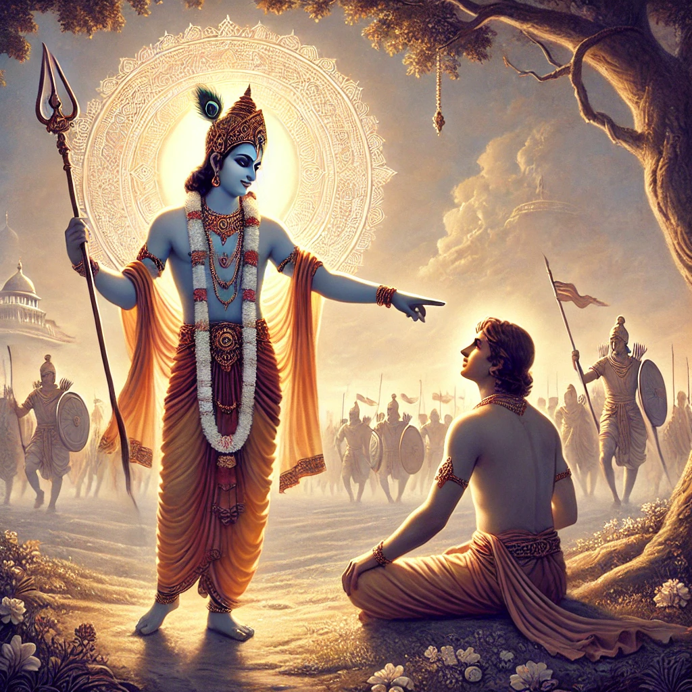

**Bhagavad Gita - Verse 2.17**        

avināśi tu tad viddhi yena sarvam idaṁ tatam |
vināśam avyayasyāsya
na kaścit kartum arhati ||

**Translation:**      
"Know that to be indestructible by which all this is pervaded. None can bring about the destruction of that which is imperishable."

**Explanation:**            
In this verse, Krishna explains to Arjuna that the soul, or the Atman, is eternal and indestructible. While the body may undergo changes, the essence within—our true self—cannot be destroyed or harmed. This understanding is a cornerstone in the Gita's teachings about life, death, and the nature of existence, encouraging Arjuna to look beyond the physical body and understand the eternal nature of the soul.
