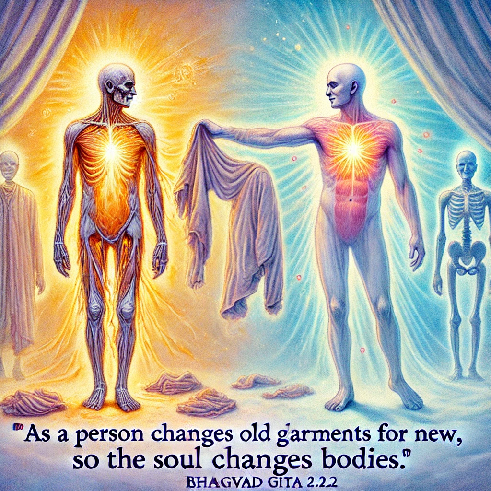

In the Bhagavad Gita, Chapter 2, Verse 22, Lord Krishna uses a metaphor to describe the nature of the soul and its eternal quality. The verse is as follows:

Verse (Sanskrit):
Vāsānsi jīrṇāni yathā vihāya
Navāni gṛhṇāti naro’parāṇi
Tathā śarīrāṇi vihāya jīrṇāni
Anyāni saṁyāti navāni dehī

Translation:
"As a person puts on new garments, giving up old ones, similarly, the soul accepts new material bodies, giving up the old and useless ones."

In this verse, Lord Krishna explains that just as we discard worn-out clothes and wear new ones, the soul, which is eternal, discards the old body and takes on a new one. This emphasizes the idea that the soul is unaffected by the physical changes of the body and continues its journey beyond physical death.
