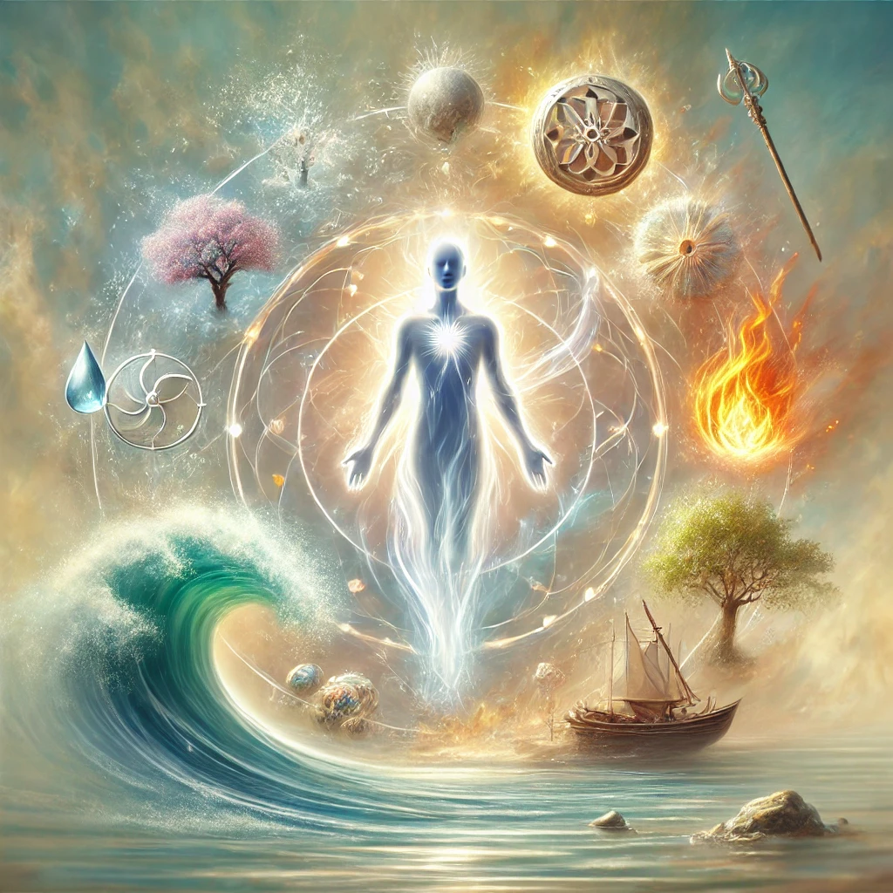

Bhagavad Gita, Chapter 2, Verse 23:

Sanskrit:
na chhainam chhindanti shastrani na chainam dahati pavakah |
na chainam kledayantyapo na shoshayati marutah ||

Translation:
Weapons cannot cut the soul, nor can fire burn it;
Water cannot wet it, nor can the wind dry it.

Explanation:
In this verse, Lord Krishna explains to Arjuna the indestructible and eternal nature of the soul (Atman). The soul cannot be harmed by physical elements like weapons, fire, water, or wind, as it is beyond the material realm. This verse emphasizes the immortality and invulnerability of the soul, reinforcing the spiritual concept that our true essence remains unaffected by physical changes or destruction.
