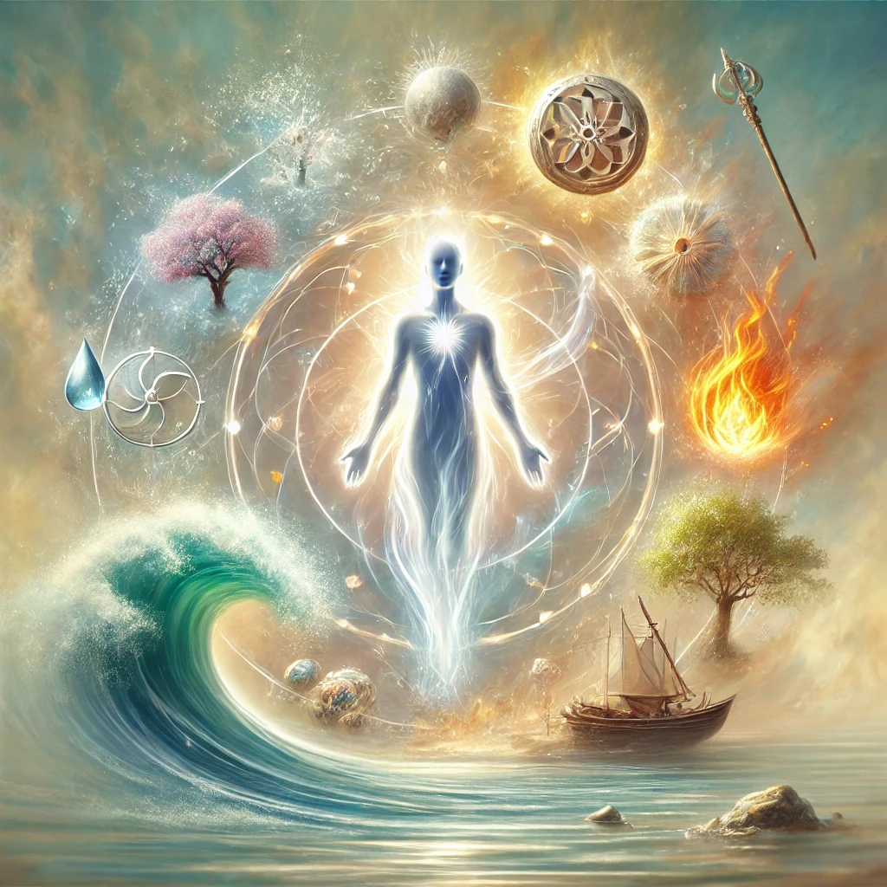

Bhagavad Gita, Chapter 2, Verse 24:

"acchedyo’yam adāhyo’yam akledyo’śoṣya eva ca nityaḥ sarvagataḥ sthāṇur acalo’yaṁ sanātanaḥ"

Translation: This individual soul is unbreakable and insoluble; it can be neither burned nor dried. It is everlasting, present everywhere, unchangeable, immovable, and eternally the same.

Explanation: Here, Lord Krishna continues to describe the qualities of the soul, highlighting its eternal and immutable nature. Unlike the body, which is subject to change and decay, the soul remains unaffected by physical transformations or environmental factors. It exists everywhere (all-pervading) and is beyond the influence of time and space. This verse is meant to help one understand that our true essence is spiritual and unchanging, offering comfort in the face of the temporary and ever-changing nature of material existence.
