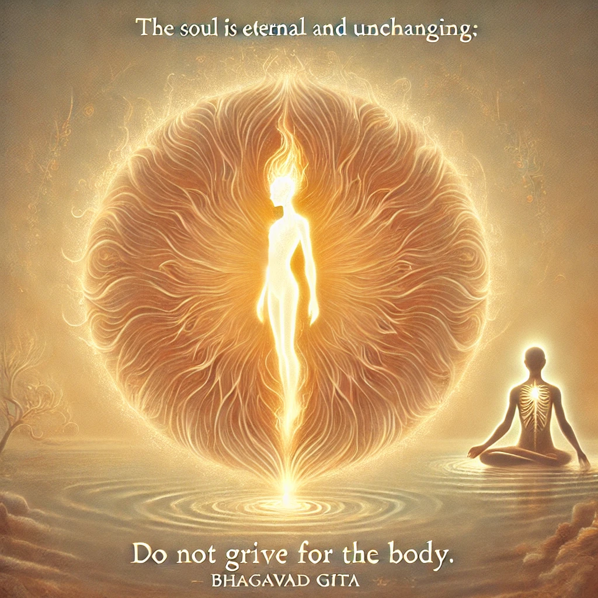

**Here are the verses 2.25 and 2.26 from the Bhagavad Gita:**    

**Bhagavad Gita 2.25:**      
"Avyakto 'yam acintyo 'yam avikaryo 'yam ucyate,
tasmad evam viditvainaṃ nanusocitum arhasi."

**Translation:**     
This soul is unmanifest, inconceivable, and unchangeable. Knowing this, you should not grieve for the body.

**Bhagavad Gita 2.26:**      
"Atacainam nitya-jatam nityam va manyase mrtam,
tathapi tvaṃ mahatmanam socitum arhasi."

**Translation:**      
But if you think that the soul is born and dies permanently, you still have no reason to grieve, O mighty-armed.

These verses are part of Lord Krishna's teachings to Arjuna, explaining the eternal and imperishable nature of the soul.
