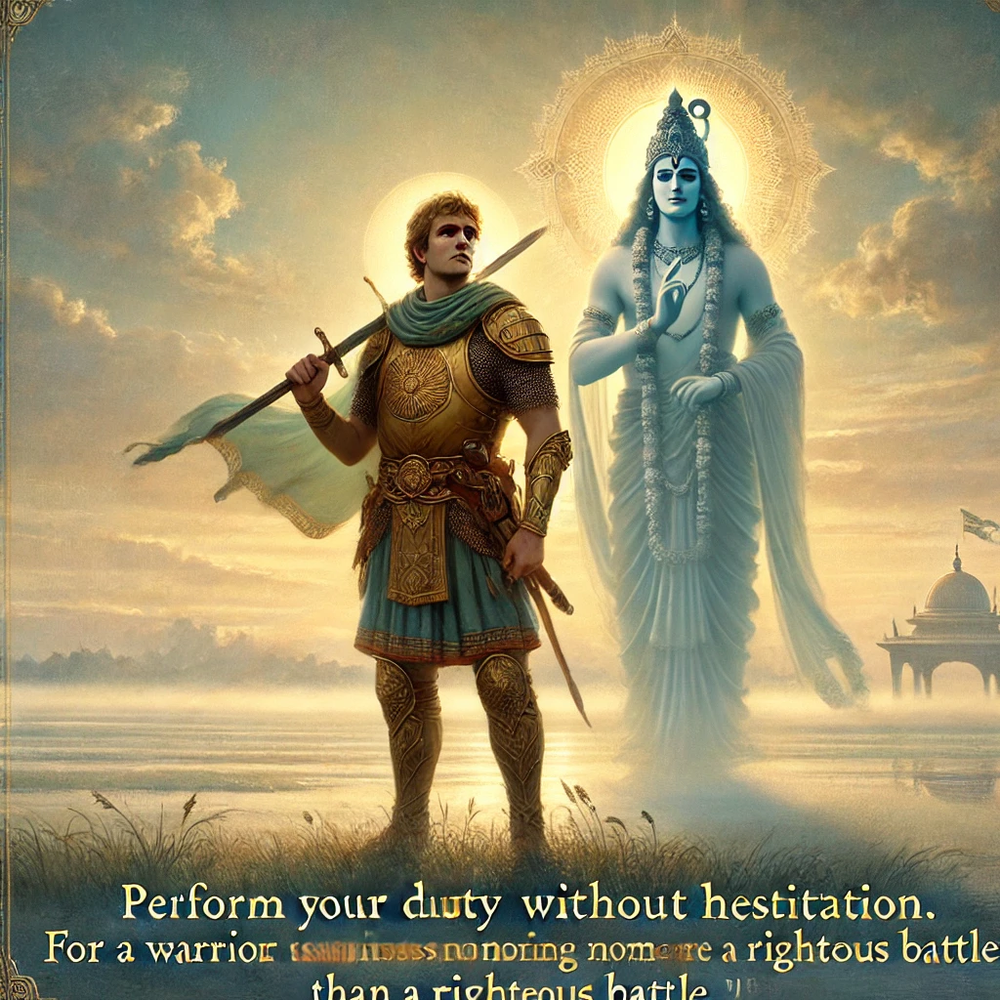

**Here is verse 2.31 from the Bhagavad Gita:**      

स्वधर्ममपि चावेक्ष्य न विकम्पितुमर्हसि।
धर्म्याद्धि युद्धाच्छ्रेयोऽन्यत्क्षत्रियस्य न विद्यते।।

**Transliteration:**           

svadharmam api cāvekṣya na vikampitum arhasi
dharmyād dhi yuddhāc chreyo ’nyat kṣatriyasya na vidyate

**Translation:**               

Considering your duty as a warrior, you should not waver. For a warrior, there is nothing more honorable than a battle against evil.

In this verse, Lord Krishna advises Arjuna to remember his duty (svadharma) as a warrior (Kshatriya). According to Krishna, engaging in a righteous battle is the highest form of duty for a warrior, and turning away from it would not bring honor or spiritual growth. This verse emphasizes the importance of fulfilling one's responsibilities based on one's nature and role in society.
