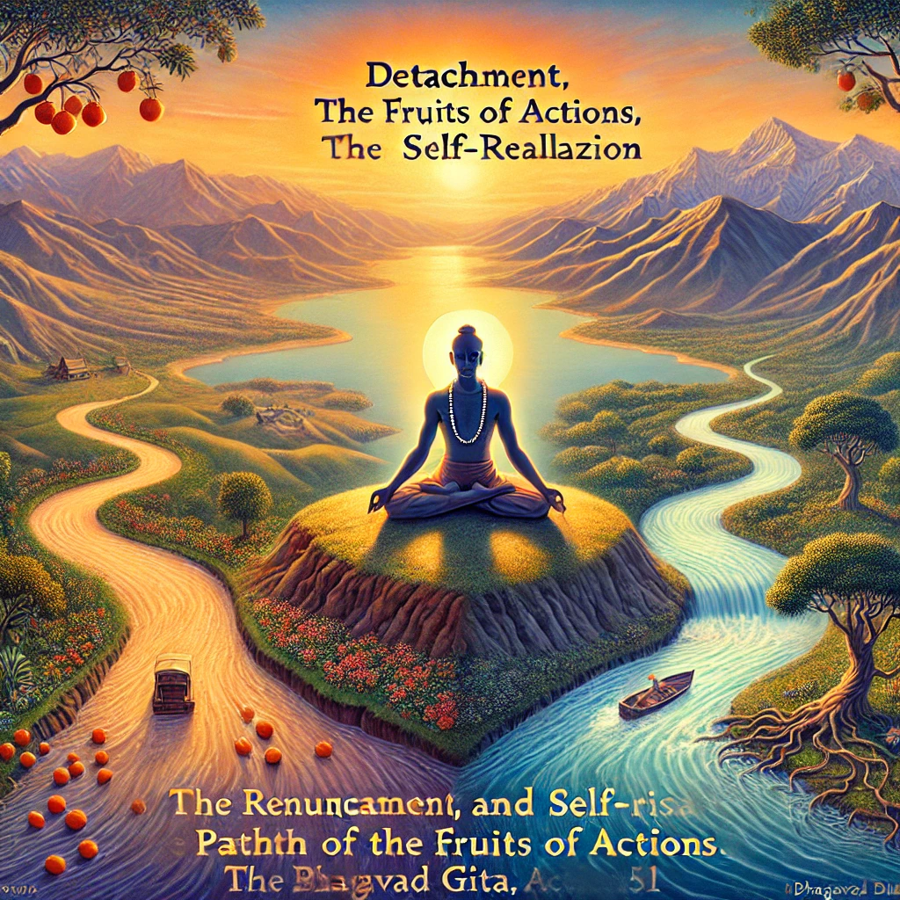

**Bhagavad Gita, Chapter 2, Verse 51 (Sanskrit and translation):**        

**Sanskrit:**          
करमजं बुद्धियुक्ता हि फलं त्यक्त्वा मनीषिणः।          
जन्मबन्धविनिर्मुक्ताः पदं गच्छन्त्यनामयम्॥           

**Transliteration:**                  
Karmajam buddhiyukta hi phalam tyaktva manīṣhiṇaḥ            
Janmabandhavinirmuktāḥ padam gacchantyanāmayam            

**Translation:**                    
The wise, endowed with an evenness of mind and devotion to wisdom, renounce the fruits born of actions. Freed from the bondage of birth and death, they attain the supreme state that is beyond all suffering.            

**Commentary:**                         
This verse emphasizes the philosophy of Karma Yoga—acting selflessly without attachment to the results. Those who align their intellect (buddhi) with such understanding are not entangled by the outcomes of their actions. By renouncing desires and expectations tied to material results, they transcend the cycle of birth and death (janma-bandha) and achieve liberation (moksha), entering a state of eternal peace and bliss (anamayam).          
