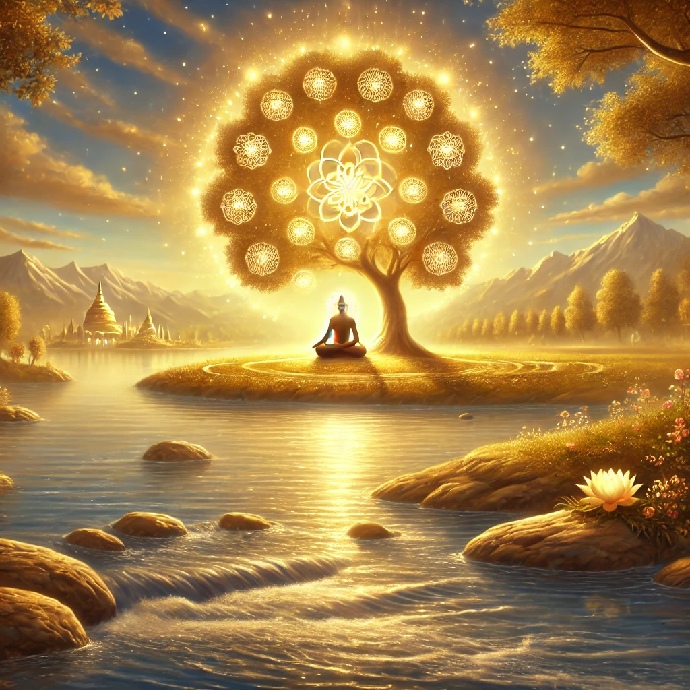

Here is Shloka 2.72 from the Bhagavad Gita, Chapter 2 (Sankhya Yoga), along with its translation:

**Sanskrit:**      
एषा ब्राह्मी स्थिति: पार्थ नैनां प्राप्य विमुह्यति।      
स्थित्वास्यामन्तकालेऽपि ब्रह्मनिर्वाणमृच्छति॥        

**Transliteration:**      
eṣhā brāhmī sthitiḥ pārtha naināṁ prāpya vimuhyati          
sthitvāsyām anta-kāle ’pi brahma-nirvāṇam ṛichchhati         

**Translation:**      
This is the state of a realized soul, O Arjuna. Having attained this state, one is no longer deluded. Even at the moment of death, being established in this state, one attains the liberation of Brahman (supreme bliss).          

**Explanation:**       
This verse concludes Chapter 2 by summarizing the ideal spiritual state. It emphasizes that one who has achieved the Brahmi sthiti (state of spiritual realization) is free from delusion and attachments. Such a person, firmly rooted in knowledge and self-control, attains liberation even at the end of their life. The teaching serves as an inspiration for self-discipline and realization of the eternal truth.
