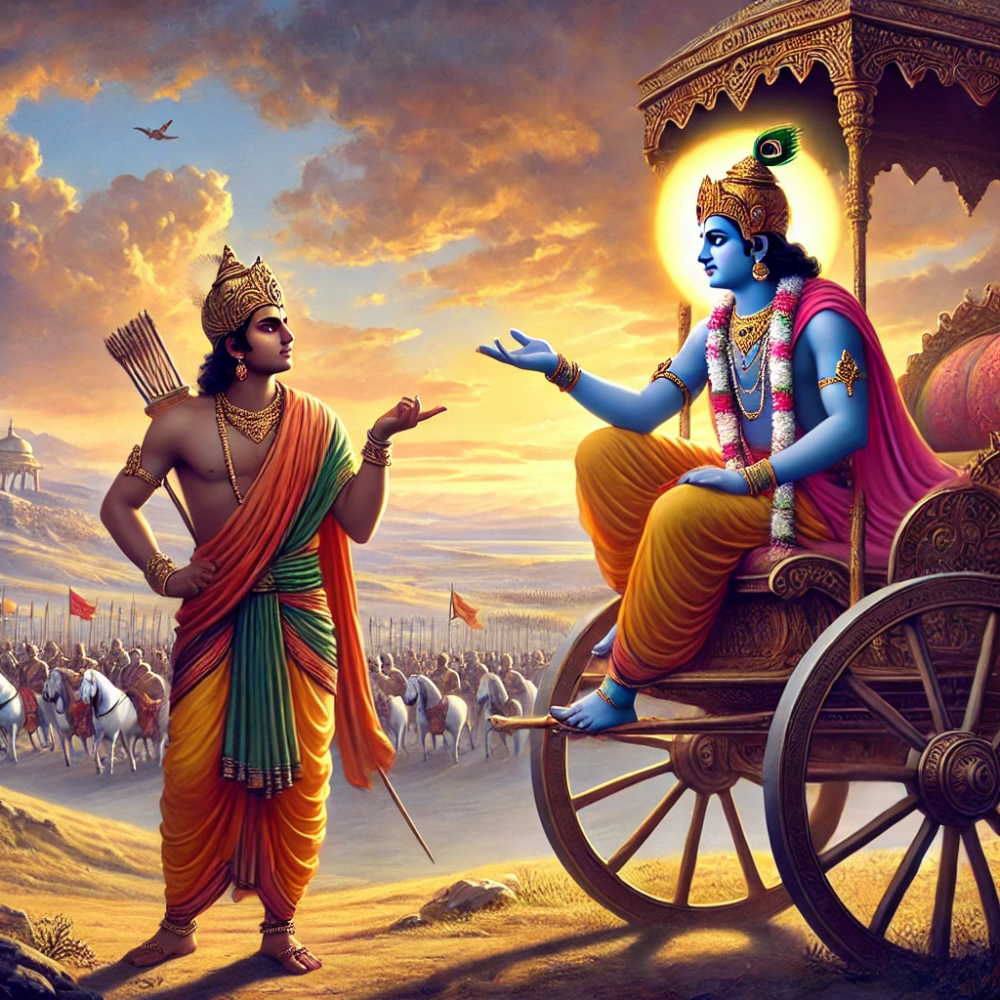

Here is Shloka 3.1 from the Bhagavad Gita, Chapter 3 (Karma Yoga), along with its translation:

**Sanskrit:**      
अर्जुन उवाच:            
ज्यायसी चेत्कर्मणस्ते मता बुद्धिर्जनार्दन।          
तत्किं कर्मणि घोरे मां नियोजयसि केशव॥           

**Transliteration:**      
arjuna uvācha:         
jyāyasī chet karmaṇas te matā buddhir janārdana            
tat kiṁ karmaṇi ghore māṁ niyojayasi keśava               

**Translation:**        
Arjuna said:
If you consider knowledge (Jnana Yoga) to be superior to action (Karma Yoga), O Janardana (Krishna), then why are you urging me to engage in this dreadful action (war), O Keshava?

**Explanation:**        
Arjuna is confused because Krishna earlier praised both knowledge and renunciation. In this verse, Arjuna questions why Krishna, after extolling the superiority of wisdom, is encouraging him to perform a seemingly violent and dreadful act like war. This marks the beginning of Arjuna's inquiry into the balance between knowledge and action, setting the stage for the teachings of Karma Yoga (the Yoga of Action).
