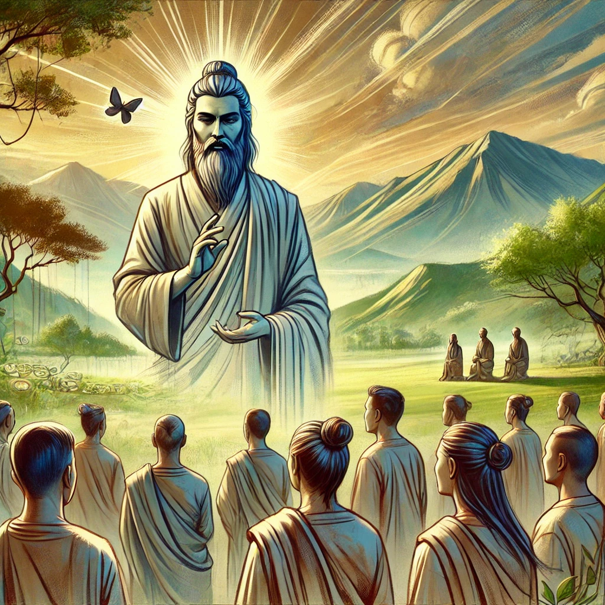

**Bhagavad Gita, Chapter 3, Shloka 21 (3.21):**      

यद्यदाचरति श्रेष्ठस्तत्तदेवेतरो जनः।
स यत्प्रमाणं कुरुते लोकस्तदनुवर्तते॥

**Transliteration:**                  
Yad yad ācarati śhreṣhṭhas tat tad evetaro janaḥ
Sa yat pramāṇaṁ kurute lokas tad anuvartate

**Translation:**                
Whatever actions a great person performs, common people follow. Whatever standards they set by their exemplary acts, the world pursues.

**Explanation:**          
This shloka emphasizes the responsibility of leaders or individuals in influential positions. Their actions set an example for others to emulate. If they act virtuously and uphold dharma (righteousness), society is likely to follow their lead, creating a positive impact. Conversely, if they act irresponsibly, it can misguide others.
             
This verse underscores the importance of leading by example and being mindful of one's actions, especially when in a position of influence.
