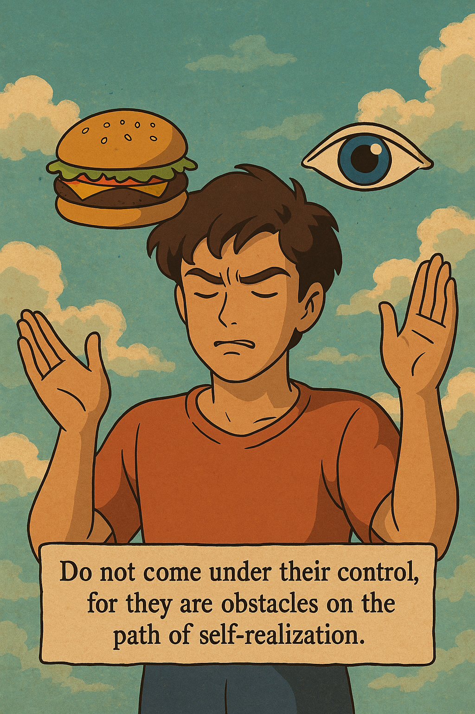

![]

**Bhagavad Gita – Chapter 3, Shloka 34 (3.34):**    

इन्द्रियस्येन्द्रियस्यार्थे रागद्वेषौ व्यवस्थितौ |
तयोर्न वशमागच्छेत्तौ ह्यस्य परिपन्थिनौ ||

**Transliteration:**    

Indriyasyendriyasyārthe rāga-dveṣau vyavasthitau
Tayor na vaśam āgacchet tau hyasya paripanthinau

**Translation (in simple English):**     
Every sense (like eyes, ears, tongue, etc.) naturally feels attraction and aversion toward its objects (like sight, sound, taste, etc.). But one should not come under their control, because they are obstacles on the path of self-realization.

**Meaning:**    
Desire (rāga) and aversion (dveṣa) are natural reactions of the senses. However, letting them control you can derail your growth, peace, and purpose. Krishna is basically saying: Don't be a slave to your senses — they're meant to serve you, not rule you.
