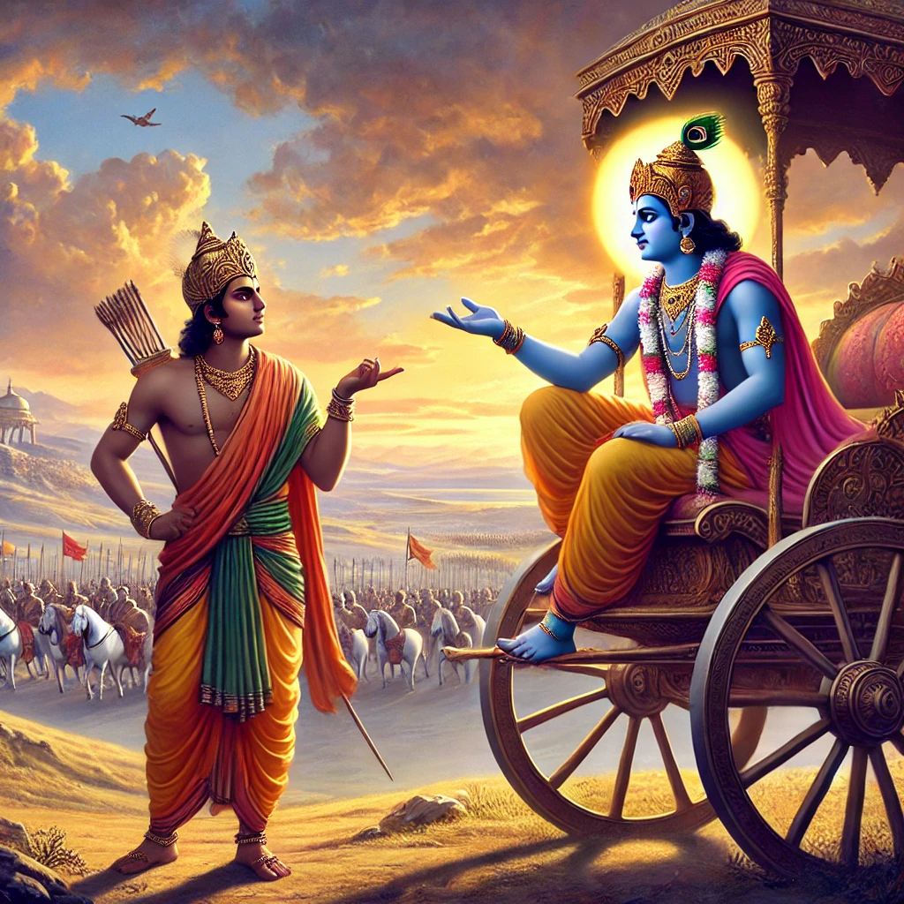

Bhagavad Gita – Chapter 3, Shloka 37 (3.37):
Sanskrit:
श्रीभगवानुवाच
काम एष क्रोध एष रजोगुणसमुद्भवः |
महाशनो महापाप्मा विद्ध्येनमिह वैरिणम् || 3.37 ||

Transliteration:
śhrī-bhagavān uvācha
kāma eṣha krodha eṣha rajo-guṇa-samudbhavaḥ
mahāśhano mahā-pāpmā viddhyenam iha vairiṇam

Translation (by meaning):
The Blessed Lord said:
It is desire, it is anger, born of the mode of passion (rajas), all-devouring and extremely sinful. Know this to be the enemy in this world.

Interpretation:
In this verse, Lord Krishna explains to Arjuna the root cause of human downfall. He says that desire (kāma) and anger (krodha), which arise from the rajasic quality (activity and restlessness), are powerful forces that cloud wisdom. They consume a person’s judgment and lead to sinful actions. Hence, one should recognize them as enemies that obstruct the path to spiritual growth and self-realization.
