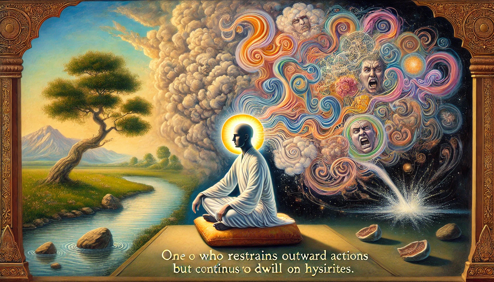

**Bhagavad Gita - Chapter 3, Verse 6 (Shloka 3.6):**

"Karmeṇdriyāṇi saṁyamya ya āste manasā smaran।            
Indriyārthān vimūḍhātmā mithyācāraḥ sa ucyate॥"            

**Translation:**         
One who restrains the organs of action but continues to dwell upon the sense objects in the mind is deluded and is called a hypocrite.

**Explanation:**             
This verse warns against false renunciation. It criticizes those who outwardly refrain from physical actions yet internally remain attached to desires and sensory pleasures. True discipline requires control over both external actions and internal thoughts. Simply suppressing actions while entertaining desires in the mind is self-deceptive and does not lead to spiritual progress.
