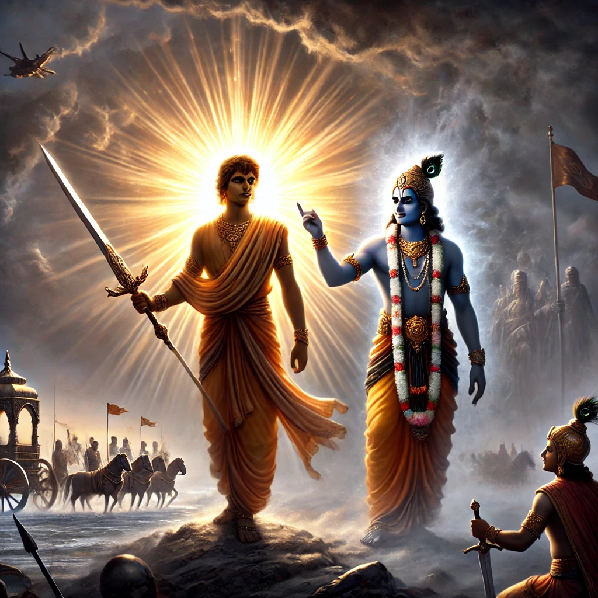

**Chapter 4**       
**Verse 4.42**     
**tasmadadhnyanasambhutam hrutstham dnyanasina̕̕tmanah.
chhittvainam sanshayam yogamatishthottishth bharat**

**Explanation:**     
In this verse, Lord Krishna is addressing Arjuna (referred to as "Bharata," from the lineage of Bharata). He tells Arjuna to overcome the doubts in his mind, which have emerged from ignorance. These doubts have taken root in his heart and are preventing him from fulfilling his duty. Krishna advises Arjuna to use the sword of knowledge (discrimination between the eternal and the non-eternal) to destroy those doubts. The "yoga" here refers to the disciplined action, aligning oneself with one's higher purpose, through which one can overcome confusion and inner turmoil. Krishna encourages Arjuna to rise above these doubts, take refuge in yoga, and move forward with confidence. In essence, the verse emphasizes the importance of using wisdom and knowledge to dispel ignorance and hesitation, and to act with clarity and purpose.        

**More detailed Explanation with Examples**      
Aatma agyan se mann par sanchay hai. Gyan ki talwar se katna hai.  
There are two types of sanchay:- 
- Sthool Sanchay:- Ek satya ko chhod ke 70 types ke sansarik things ko pakad na. 
- Suchhm Sanchay:- Satihi satya ko pakad liya.     
Satya is like stem cell. Avidya bahari hota hai. Upanishads help us to move from Avidya to Vidya. Upanishads are Avidya also. Ahankar ko satya chahiye, utna hin jitna uski pocket mein aa sake. Whenever we see our jhunupana,start laughing on it, start disowning it. They say that you are glorious and i say i am hilarious. Ahankar is created due to our seriousness. 
