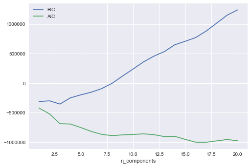
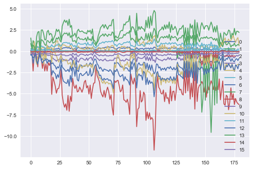

Time Series Clustering - Mixture Models for Clustering

Following are the steps in using mixture models for Clustering:-
    
1. Fit the mixture model
2. Compute 

 represents the posterior probability that point i belongs to cluster k.


Previous procedure is soft clustering.

Assuming this is small, it may be reasonable to compute a hard clustering using the MAP estimte, given by 


We call this procedure 


```python
import os
import pandas as pd
%matplotlib inline
import matplotlib.pyplot as plt
import seaborn as sns; sns.set()
import numpy as np
from sklearn.mixture import GaussianMixture

path = '/Users/avinashbarnwal/Desktop/Machine Learning/Daily'
os.chdir(path)
X = pd.read_csv("simola_natural_yeast_imputed.csv",sep=",",header='infer',index_col=0)
```

One of the most important parameter is covariance type which is "full" leading to exhaustive search


```python
n_components = np.arange(1, 21)
models = [GaussianMixture(n, covariance_type='full', random_state=0).fit(X)
          for n in n_components]

plt.plot(n_components, [m.bic(X) for m in models], label='BIC')
plt.plot(n_components, [m.aic(X) for m in models], label='AIC')
plt.legend(loc='best')
plt.xlabel('n_components')
```



```python
gmm = GaussianMixture(n_components=16, covariance_type='full').fit(X)
for i in range(16):
    plt.plot(gmm.means_[i], label=i)
plt.legend(loc='best')
```

