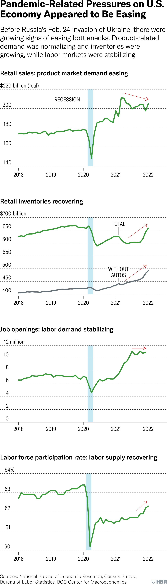

# Current risks to US Economy

As of date - 20th March-2022, there are multiple risks associated to US economy. Inflation, Covid-19 and Country War.

## How stimulus bet turned out
Inflation has increased 40 year high with 7.5% but supply chain disruption could be reason also.

## Pressure appeared to have peaked
Retail sales, retail inventories and labor participation looks good.

## How the War Drives Up Recession Risk
Impact could be through three transmission channels.
- Financial Recession - Liquidity or capital problems.
- Real Economy Recession - Drive demand or supply shocks.
  - Energy Prices(direct effects) - Oil going up.
  - Energy Prices(confidence impact) - Consumer confidence going down.
  - Wealth Effects - Inflation make people feel less wealthy.
  - Supply-Chain Disruptions - Supply Chain being broken.

Despite the headwinds of War Crisis, its not clear that it outweighs the tailwinds of the US Economy positives.
- Growth is decelerating but seems stable.
- Household looks healthy.
- US and Russia linkage is less.
- Labor market remain tight.
- Firms remain profitable.

## A policy Error Remains the Central Recession Threat
- Wrong tighting of interest rate can lead to recession.
- Less tighting of interest rate can lead to further inflation.

## What Executives can do
- Dont rely on the forecasts.
- Do build the capabilities to analyze and model the transmissions of shocks and stress test using planning
- Dont assume shocks drive structural changes.
- Dont assume that pricing power persists.
- Do think of productivity growth as competitive advantage.

