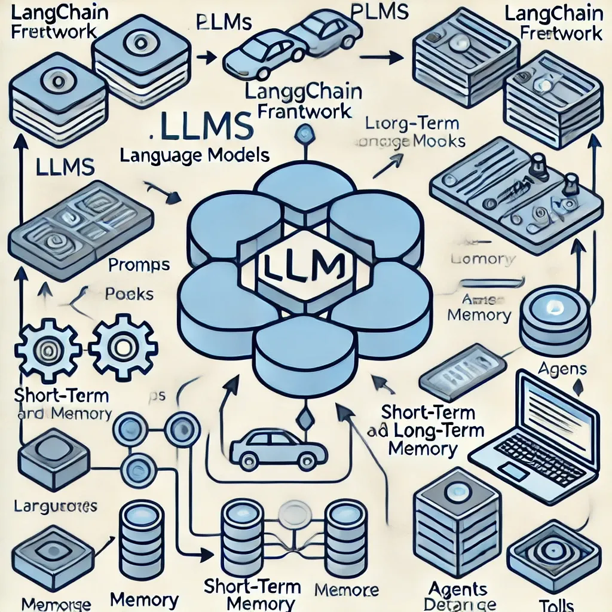

Here is the improved flowchart with better spacing to avoid overlapping text. It visually maps out the perspectives of Osho and Krishnamurti, highlighting:

- Truth as the central authority.
- **Osho’s view:** The Guru embodies Truth, using playful and urgent methods.      
- **Krishnamurti’s view:** No authority should be given to individuals, emphasizing direct inquiry.        
- **Common essence:** Both teachings converge on the principle that Truth is the only real authority.       

- **Misunderstandings:**
  - Osho’s approach risks personality worship.
  - Krishnamurti’s followers risk elevating the ego as the authority.     
- Resolution: Achieving a complementary understanding between the two methods.     
- Acharya Prashant: Integrates both approaches, balancing seriousness with humor and intellectual engagement.
