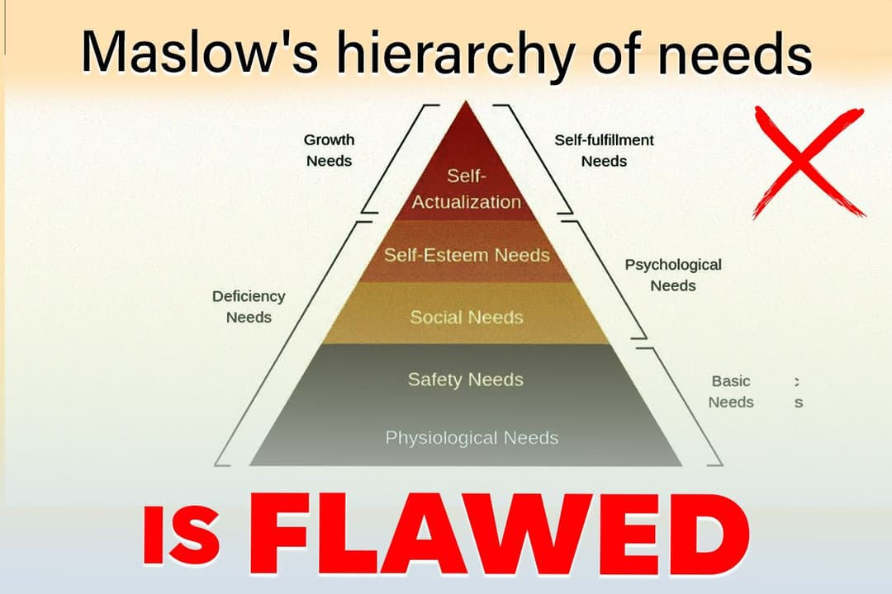

**Here’s a concise summary of Acharya Prashant's take on Maslow’s hierarchy of needs:**

**Critique of Maslow’s Model:**      
Acharya challenges the sequential nature of Maslow's pyramid, arguing that self-actualization isn’t a distant, final goal but rather the foundation and purpose behind all actions.

**Self-Actualization as a Universal Drive:**       
Every human action—whether pursuing food, relationships, esteem, or wealth—directly or indirectly aims at self-actualization, even if the individual is unaware of it.

**Proxy Pursuits and Delusion:**          
People often seek temporary goals (like money, relationships, or status), mistakenly believing these will fulfill them. Acharya explains that these are proxies for the deeper need for self-actualization.

**Spiritual Interpretation:**        
Self-actualization is aligned with the idea of liberation or God-attainment. Even seemingly mundane or negative actions are rooted in the human longing for fulfillment.

**Unified Motivation:**        
Self-actualization permeates all aspects of life, not as a final step but as the underlying reason behind everything, including basic needs like eating or waking up.

**Early Awareness of Self-Actualization:**          
Acharya advocates raising awareness about this intrinsic need from a young age, which can help individuals align their actions with meaningful fulfillment rather than chasing superficial goals.

In summary, Acharya Prashant suggests that self-actualization is not the top of a pyramid but the essence of all human motivation. Understanding this can lead to more conscious living and meaningful choices.
