# Understanding Multimodal LLMs

In this article, I aim to explain how multimodal LLMs work and summarize recent research papers in this domain.

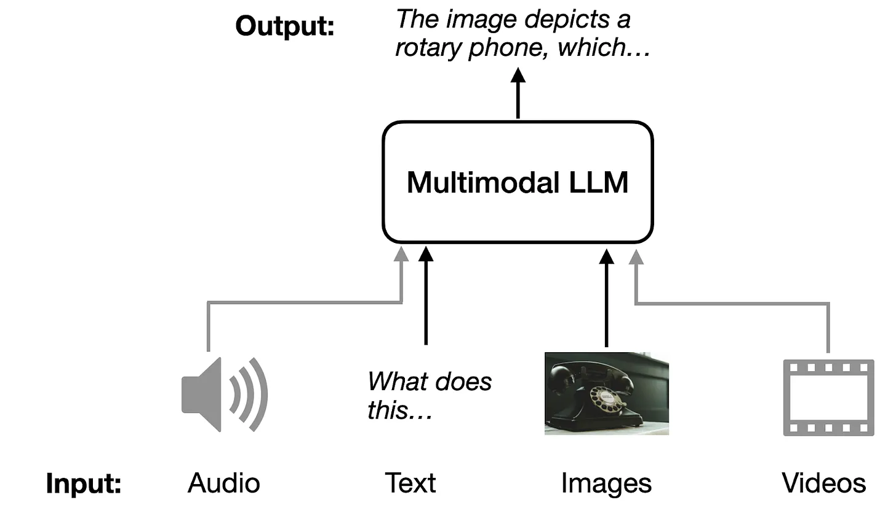

---

## 1. Use Cases for Multimodal LLMs

### What Are Multimodal LLMs?
Multimodal LLMs are large language models capable of processing diverse input types, such as text, images, and other modalities. For example:
- Summarizing an image provided as input.
- Extracting information from a PDF and converting it into LaTeX.

---

## 2. Common Approaches to Building Multimodal LLMs

Two primary methods are used to create multimodal LLMs:

### Method A: Unified Embedding-Decoder Architecture
- Converts images into embeddings with the same dimensionality as text tokens.
- Embeddings are concatenated with text tokens, allowing the LLM to process both modalities together.


### Method B: Cross-Modality Attention Architecture
- Directly integrates image and text embeddings in the attention layers using cross-attention mechanisms.

---

### 2.1 Method A: Unified Embedding-Decoder Architecture

#### 2.1.1 Understanding Image Encoders
Image encoders generate embeddings for image data by dividing the image into patches and processing them using a vision transformer.


#### 2.1.2 Role of the Linear Projection Module
Linear projection modules align the dimensions of image embeddings with text embeddings.

```python
import torch

class PatchProjectionLayer(torch.nn.Module):
    def __init__(self, patch_size, num_channels, embedding_dim):
        super().__init__()
        self.projection = torch.nn.Linear(
            patch_size * patch_size * num_channels, embedding_dim
        )

    def forward(self, x):
        batch_size, num_patches, _, _, _ = x.size()
        x = x.view(batch_size, num_patches, -1)  # Flatten patches
        return self.projection(x)

# Example Usage
batch_size, num_patches, patch_size, num_channels, embedding_dim = 1, 9, 16, 3, 768
patches = torch.rand(batch_size, num_patches, num_channels, patch_size, patch_size)
projection_layer = PatchProjectionLayer(patch_size, num_channels, embedding_dim)
projected_embeddings = projection_layer(patches)
print(projected_embeddings.shape)  # Output: torch.Size([1, 9, 768])
```

## 2.1.3 Image vs. Text Tokenization

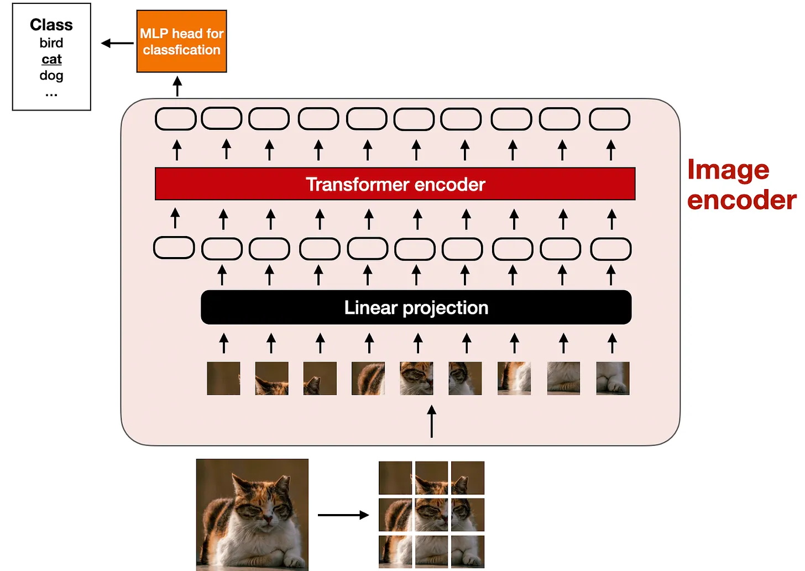

As shown in the figure above, an additional **projector module** is included after the image encoder. This projector is typically a linear projection layer, similar to the one described earlier. Its purpose is to project the outputs of the image encoder into a dimension matching that of the embedded text tokens, as illustrated below. (Note: The projector is sometimes referred to as an adapter, adaptor, or connector.)

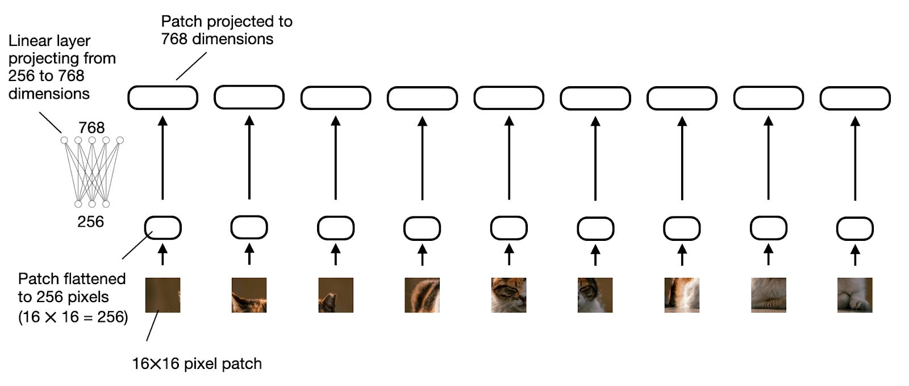

Once the image patch embeddings have the same dimension as the text token embeddings, they can be concatenated as input to the LLM. Below is the figure referenced earlier for easier visualization.

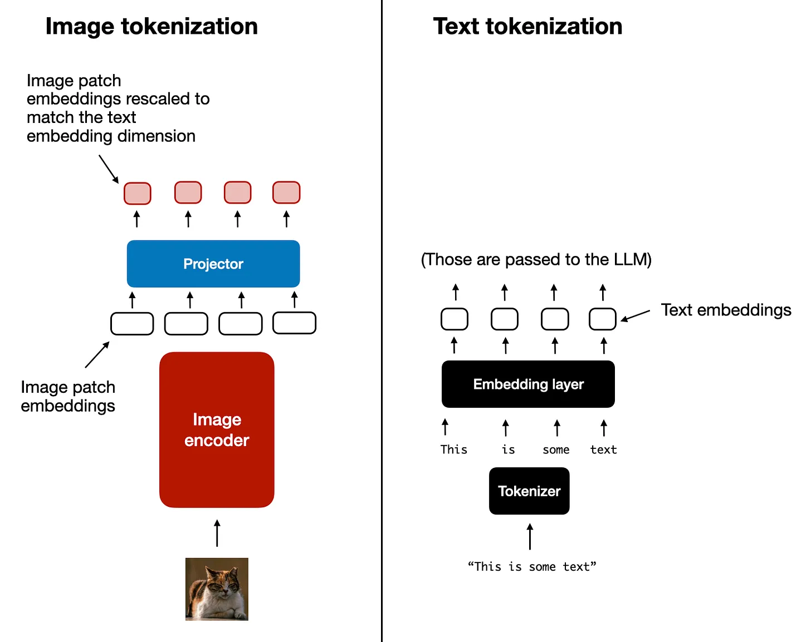

Typically, the image encoder in this section is a pretrained **vision transformer** such as CLIP or OpenCLIP. However, some implementations of Method A, such as **Fuyu**, directly operate on patches, as depicted below.

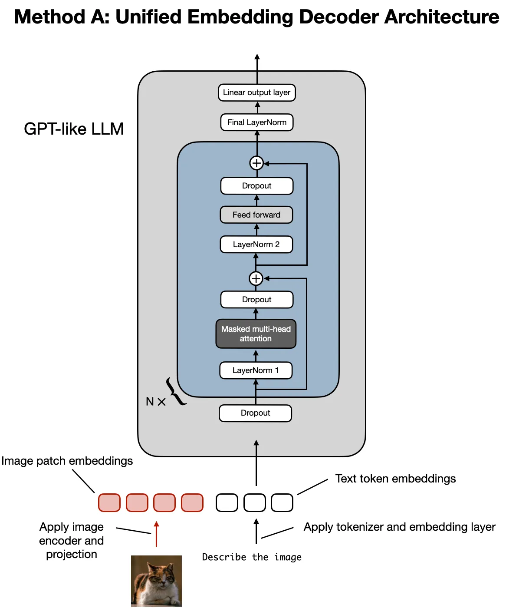

In the Fuyu architecture, the input patches are directly passed into a linear projection (or embedding layer) to learn image patch embeddings, bypassing the need for a pretrained image encoder. This approach significantly simplifies the architecture and training.

---

## 2.2 Method B: Cross-Modality Attention Architecture

Now that we’ve discussed the Unified Embedding-Decoder Architecture and its image encoding concepts, let’s look at the **Cross-Modality Attention Architecture** as summarized below.

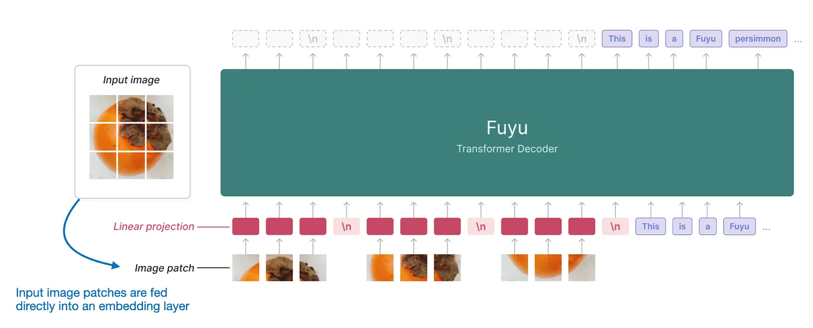

### Cross-Attention Mechanism

In this architecture, input patches are connected within the multi-head attention layer via a **cross-attention mechanism**.

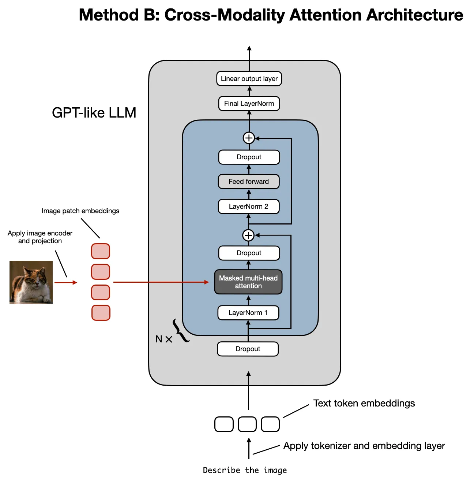

In multimodal LLMs, the encoder typically processes images rather than text, though the mechanism is conceptually similar.

### How Cross-Attention Works

Below is a conceptual illustration of how **self-attention** works in a transformer:

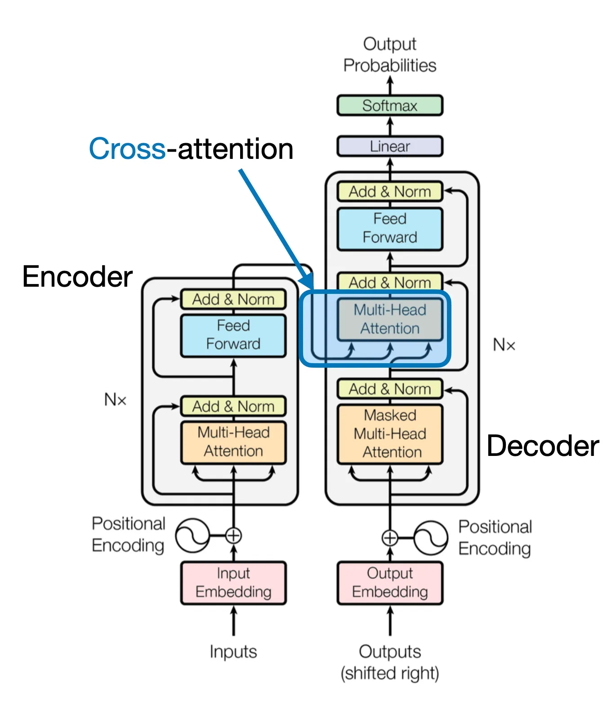

- **x** represents the input.
- **Wq**, **Wk**, and **Wv** are weight matrices used to compute queries (Q), keys (K), and values (V).
- **A** represents attention scores, and **Z** represents the output context vectors.

In contrast, **cross-attention** incorporates two different input sources, as shown here:

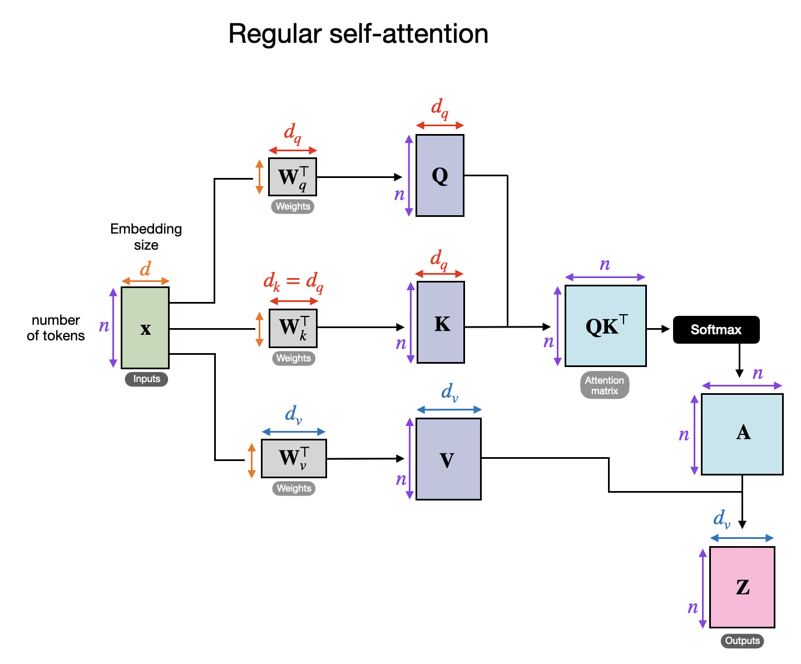

For multimodal LLMs:
- **x1** represents the decoder input sequence (e.g., text).
- **x2** represents the output of the image encoder.

The embedding dimensions of x1 and x2 must match, though their sequence lengths can differ. If **x1 = x2**, cross-attention reduces to self-attention.

---

## 3. Unified Decoder and Cross-Attention Model Training

### Training Components

Multimodal LLM training involves three main components:

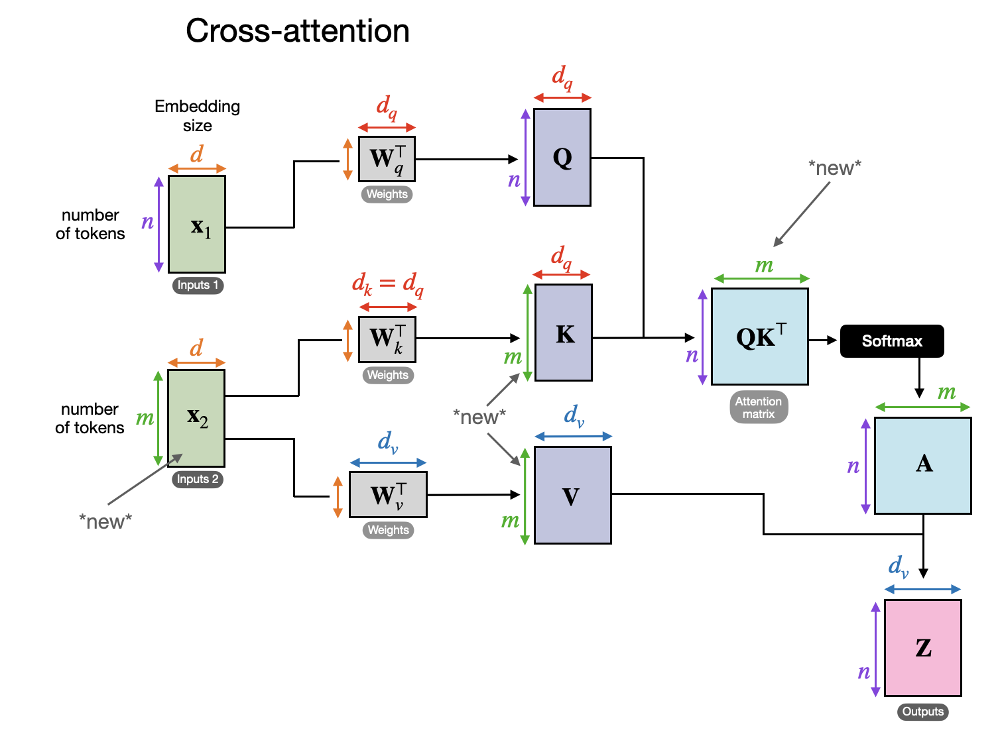

### Training Phases
1. **Pre-training**
   - Commonly uses a pretrained image encoder (e.g., CLIP) that remains frozen.
   - Focuses on training the projector module (e.g., a linear layer or small MLP).

2. **Instruction Fine-Tuning**
   - The LLM is unfrozen to allow for comprehensive updates.
   - For cross-attention-based models (Method B), cross-attention layers remain unfrozen throughout training.

### Trade-offs Between Methods
- **Method A: Unified Embedding-Decoder Architecture**
  - Easier to implement as it requires no modifications to the LLM architecture.
- **Method B: Cross-Modality Attention Architecture**
  - More computationally efficient as it introduces image tokens later in the cross-attention layers.
  - Retains the text-only performance of the original LLM if parameters are frozen during training.

---

## 4. Recent Multimodal Models and Methods

### 4.1 Llama 3 Herd of Models

The **Llama 3.2 models** (11-billion and 90-billion parameters) use the **cross-attention-based approach**.

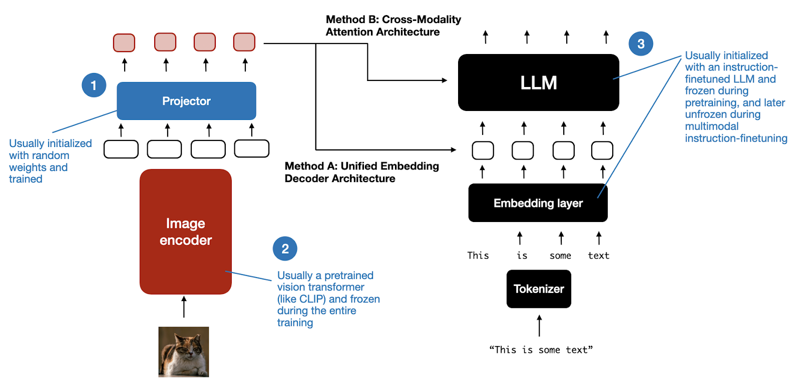

- Llama 3.2 updates the image encoder while freezing the LLM parameters to preserve text-only performance.
- Training involves:
  1. Adding an image encoder and projection layers to Llama 3.1 text models.
  2. Pretraining on image-text data.
  3. Instruction and preference fine-tuning.

---

### 4.2 Molmo and PixMo

**Molmo** simplifies training with a single unified pipeline, updating all parameters (base LLM, connector, and image encoder) simultaneously.

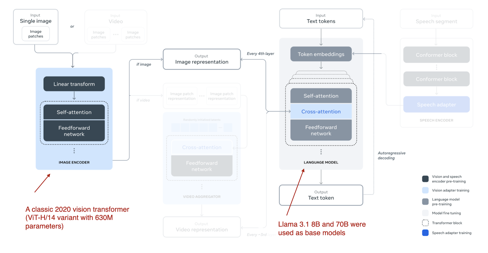

The image encoder uses CLIP, and the connector aligns image features with the LLM.

---

### 4.3 NVIDIA’s NVLM

**NVLM** explores three methods:
- **NVLM-D:** Decoder-only architecture for OCR tasks.
- **NVLM-X:** Cross-attention architecture for high-resolution images.
- **NVLM-H:** A hybrid combining both methods.

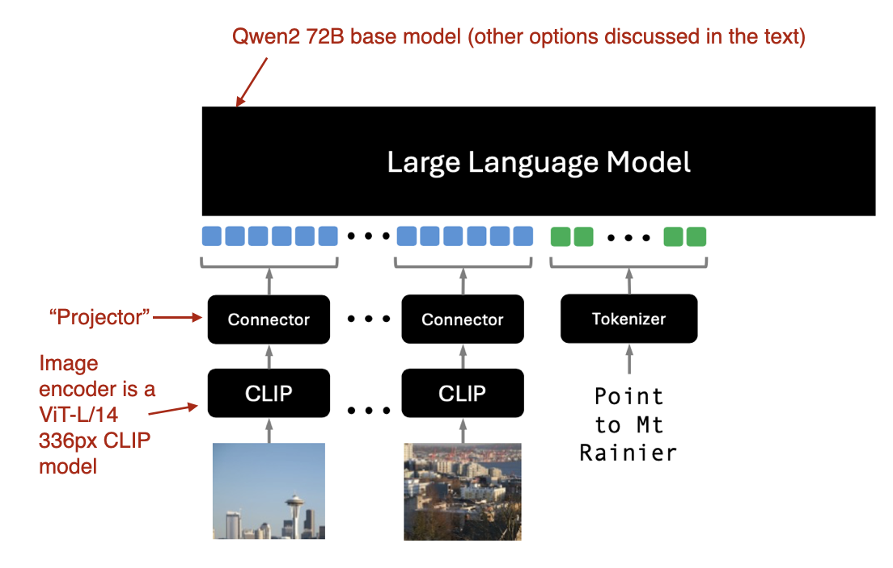

---

### 4.4 Qwen2-VL

**Qwen2-VL** introduces **Naive Dynamic Resolution**, enabling input of images in their original resolution.

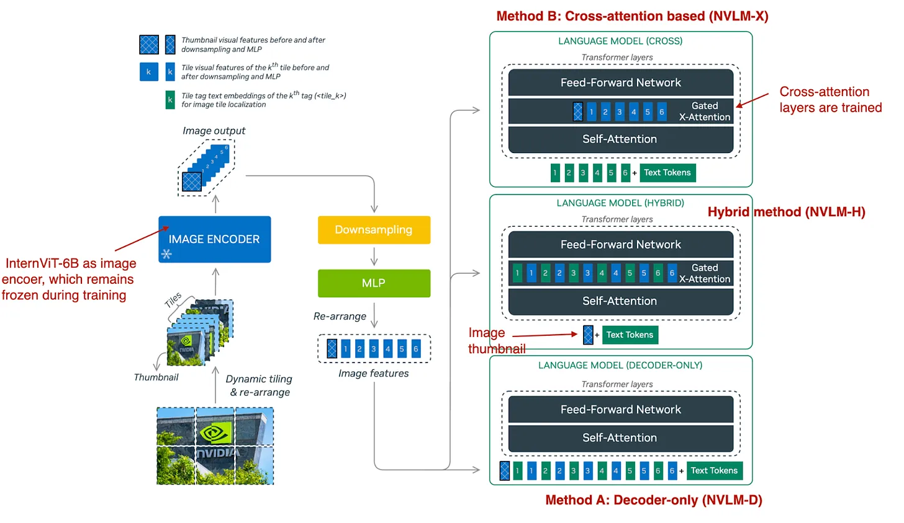

---

### 4.5 Pixtral 12B

Pixtral uses Method A with an internally trained image encoder and supports variable image sizes.

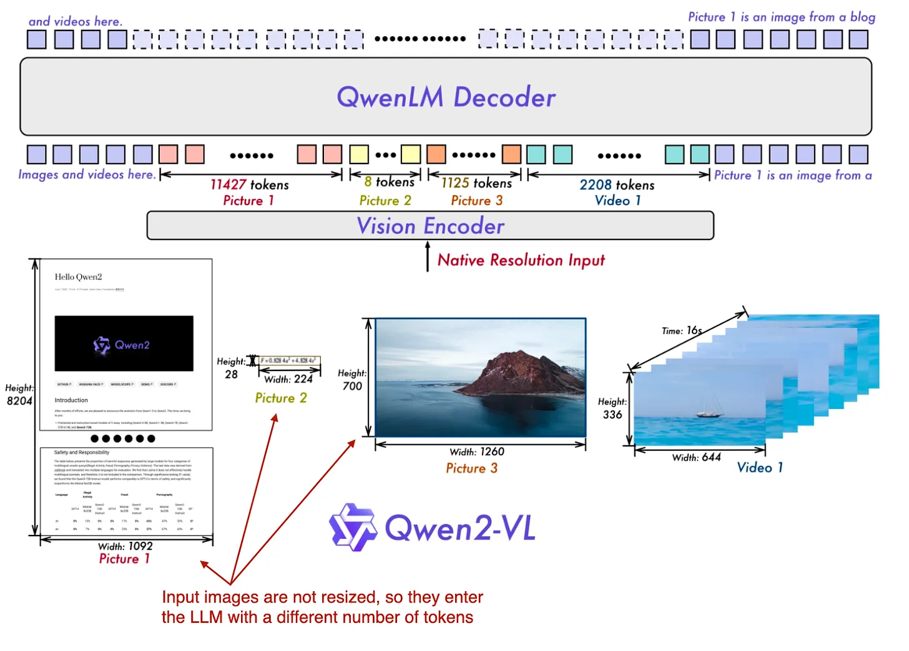

---

### 4.6 MM1.5 and 4.7 Aria

- MM1.5 focuses on ablation studies and introduces dense and mixture-of-experts models.
- Aria utilizes a **mixture-of-experts model** with 24.9 billion parameters.

---

### 4.8 Baichuan-Omni

Baichuan-Omni uses **Method A** with a structured three-stage training process:
1. Train the projector with frozen components.
2. Train the vision encoder.
3. Fine-tune the full model.

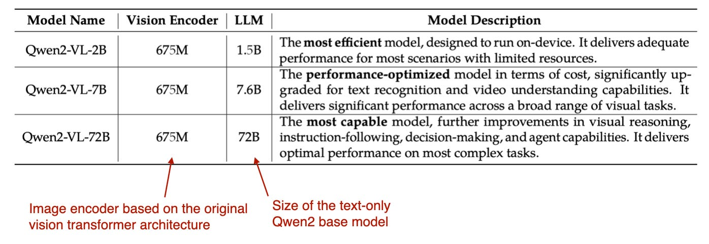

---

### 4.9 Emu3 and 4.10 Janus

- **Emu3** demonstrates image generation with transformer decoders.
- **Janus** separates encoding pathways for multimodal understanding and generation tasks.

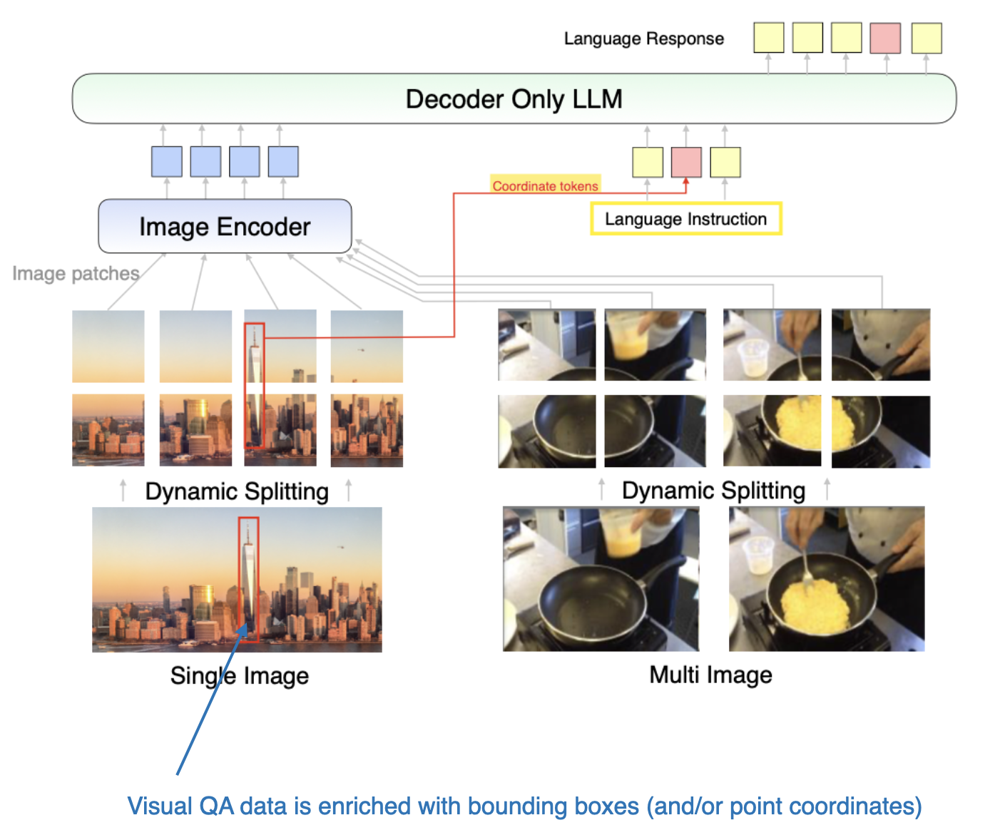

---

## Conclusion

Comparing multimodal LLMs is challenging due to varying benchmarks and architectures. NVIDIA’s NVLM provides insightful comparisons, highlighting trade-offs between decoder-only and cross-attention approaches.
