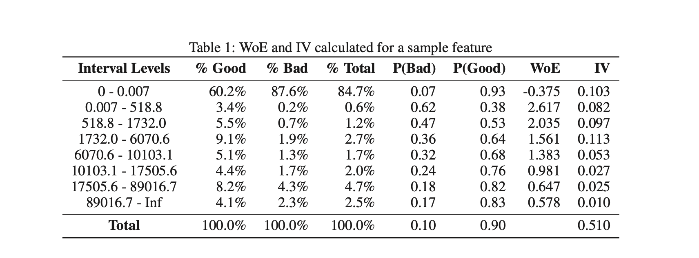
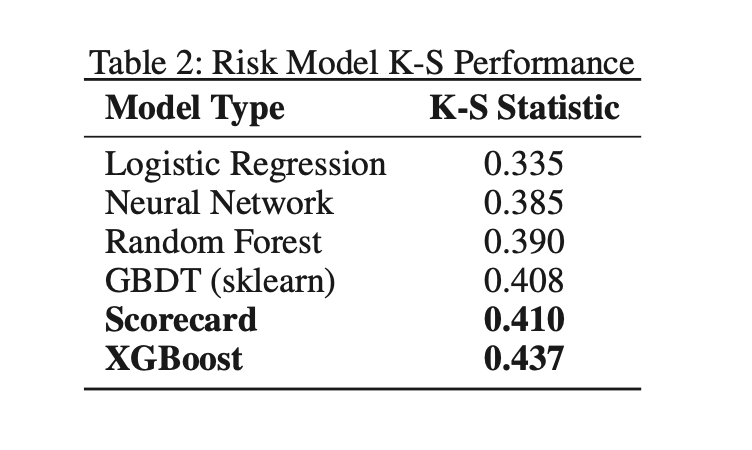
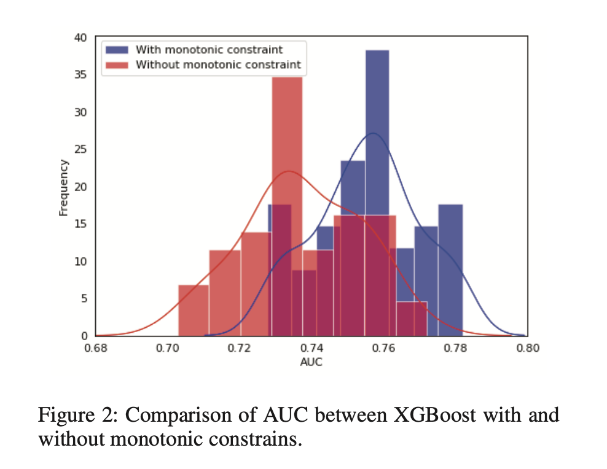
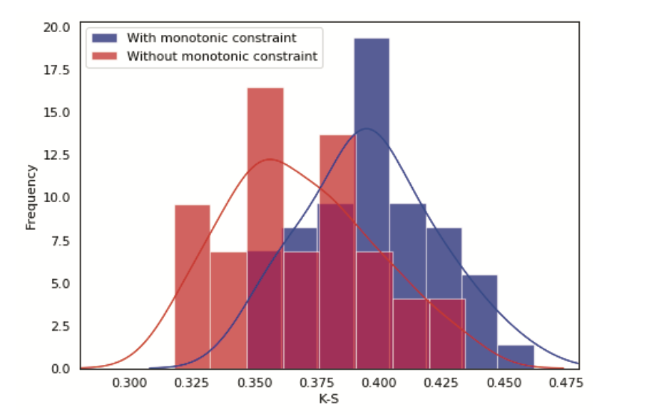

### Executive Summary
XGBoost with monotonic constraints gives 7% higher KS compared to traditional score-card model and explainability problem is being solved using SHAP explanations.

### Introduction
The complex machine learning models provide higher predictive power but it has less explainability power compared to traditional score-cards. Traditional score-cards are good in explaining the scores and attributing the variables to the score. Machine Learning Models generally have higher predictive power than traditional score-cards but lacks explaining parts as it uses tree based structure to create the cuts.

### Methodology and Results

Traditional score-cards use WOE and Information of the features as independent features. Generally cuts are used to increase IV. Manual adjustment of bins is then applied to satisfy monotonic relatiosnhip requirement. Missing and extreme feature values can be binned separately and both categorical and continuous variables can be with optimal binning.

Non Linear Risk Models(such as XGBoost, Catboost and LighGBM) may perform better than score-card models when feature feature interactions are complex. XGBoost has produced higher KS by 7%. Neural Networks performed not so good compared to tree based models given number of data points was lower compared to features. 

Adverse Action Codes are assigned based on the higher value of the features increases the risk or lowers the risk. Construction of score-card having property of the monotonic relationship between features and scores. 

Explaining the XGBoost model can be done using two techniques:-

- LIME generates random neighbor samples to weigh features according to distance from the record in question.
- SHAP calculates the feature attribution using Shapley Values. Features with the highest Shapley Values is then mapped to the AA reason code.

The monotonicity requirements that ensures credit decisions have acceptable explanations was satisfied using a features in XGBoost which forces predictions to monotonically icnrease ordecrease with respect to each feature when other features are constant. For a tree based model, right child's value is constrained to be higher than the left child's value for each split of a particular feature. Model monotonicity constraints give higher KS by 8%.

It is also important to understand the direction of impact with highly imbalanced distribution such as high contribution of missing values. It is possible that high contribution might be from missing values that has negative WOE but larger values of the variable lead to lower risks. We can handle this by creating separate dummy feature.

Scorecard vs XGBoost Explanations

Binning the population based on the scores and comparing the agreement on the features provide the clear idea of the efficacy of the model. For risky deciles, it has more agreement vs less risky declines. To find more risky customers is easy very less risky customers therefore, we see more agreement in the risky deciles.

